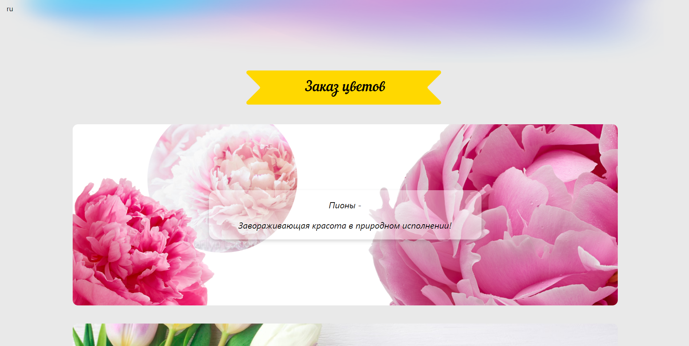
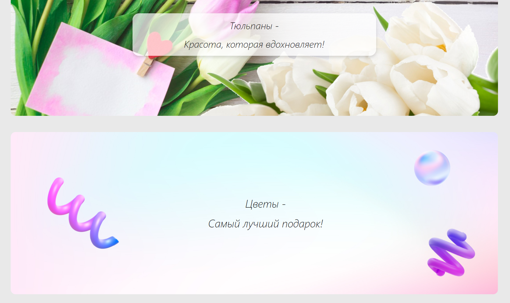
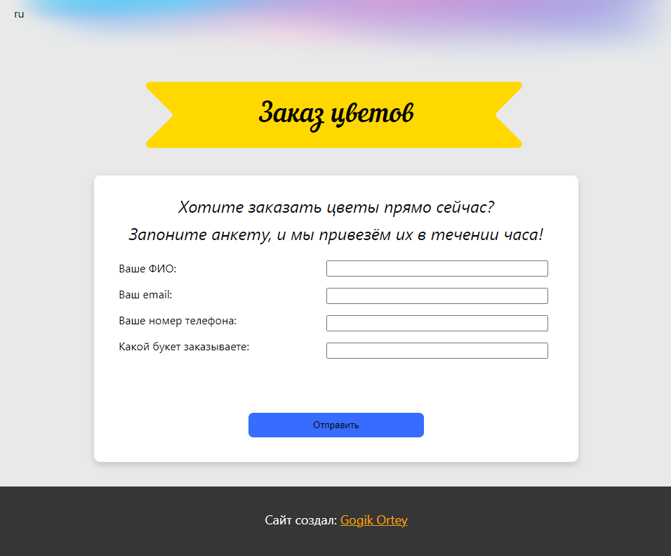

Это учебный проект одностраничного сайта на React  
Темой была выбрана страница магазина по продаже цветов

Для того, что бы запустить проект, скачайте его, и запустите файл **2_Star React.cmd**  
Если у вас не установлен React - сначала запустите файл **1_Install React.cmd**

На странице есть эффект паралакса, а также рабочая форма внизу страницы

Скриншоты сайта:

 
 
 
